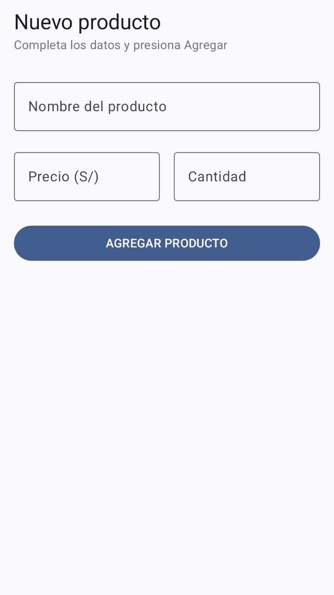
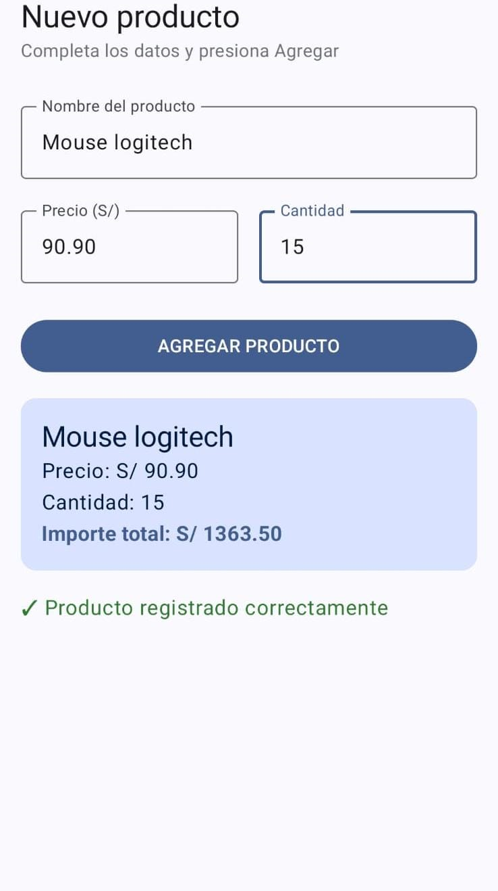

# Lab03 - Registro de Producto

**Nombre:** Alexander Faustino

## Descripción

Aplicación desarrollada con Jetpack Compose que permite registrar un producto ingresando su nombre, precio y cantidad. 
Al presionar el botón **AGREGAR PRODUCTO**, se muestra una tarjeta (Card) con el resumen del producto y el importe total 
calculado (precio × cantidad), junto con un mensaje de confirmación.
La pantalla gestiona su estado con `remember` y `mutableStateOf`, y reutiliza herramientas del Lab 02 
(`toDoubleOrNull`, `toIntOrNull`, operador Elvis `?:` y `String.format`/`.format` con 2 decimales) para leer 
y mostrar los datos de forma segura.

## Capturas

### Pantalla inicial (formulario vacío)

### Después de presionar AGREGAR PRODUCTO

## Reflexión: ¿qué pasaría si declaras las variables de los campos SIN remember?

Sin remember, el texto que escribo en los campos se borra cada vez que la pantalla se recompone (por ejemplo, al girar el celular).
Esto pasa porque mutableStateO crea el estado reactivo, pero solo remember hace que ese estado se conserve entre recomposiciones; 
sin él, la variable vuelve a su valor inicial cada vez que la función se ejecuta de nuevo.